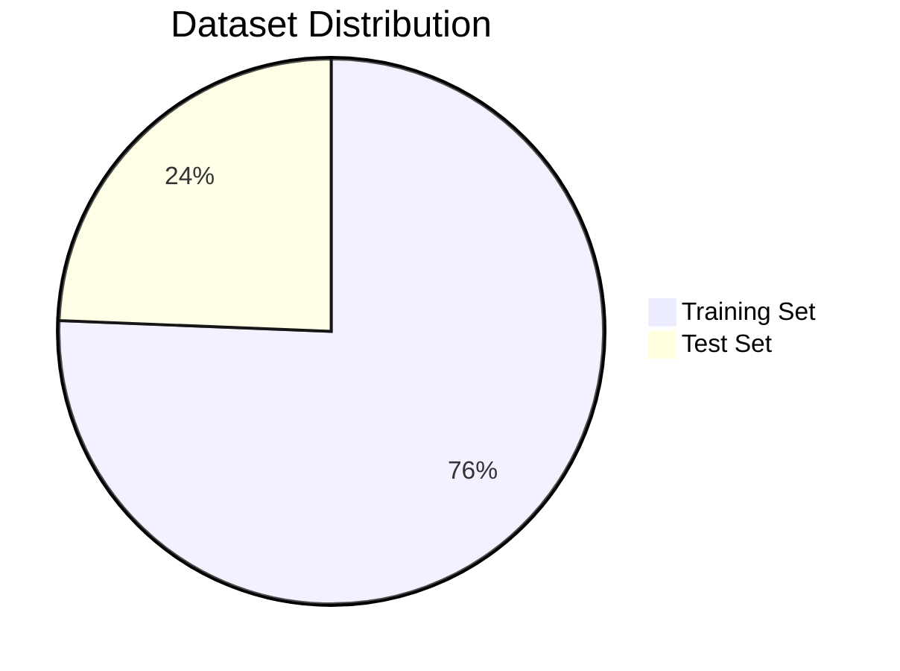

# 🚦 Mini Project Report

---


---

# Traffic Sign Classification using Deep Learning (CNN)

> **Mini Project Report** | Academic Year 2025–2026

---

## 📋 Table of Contents

1. [Team Details](#1-team-details)
2. [Title of the Project](#2-title-of-the-project)
3. [Detailed Problem Statement](#3-detailed-problem-statement)
4. [Technology & Algorithm Used](#4-technology--algorithm-used)
5. [Dataset Description](#5-dataset-description)
6. [Screenshots & Results](#6-screenshots--results)
7. [Conclusion](#7-conclusion)
8. [GitHub / OneDrive Link](#8-github--onedrive-link)

---

## 1. Team Details

| Field | Details |
|---|---|
| **Team Name** | *(Your Team Name)* |
| **Course / Branch** | *(e.g., B.E. Computer Engineering / IT)* |
| **Institute** | *(Your Institute Name)* |
| **Academic Year** | 2025 – 2026 |
| **Semester** | *(e.g., Semester VI)* |
| **Guide / Mentor** | *(Prof. Name)* |

### Team Members

| Sr. No. | Name | Roll No. | Responsibility |
|---|---|---|---|
| 1 | *(Name 1)* | *(Roll No.)* | Model Training & Evaluation |
| 2 | *(Name 2)* | *(Roll No.)* | Dataset Preparation & Web App |
| 3 | *(Name 3)* | *(Roll No.)* | Architecture Design & Testing |
| 4 | *(Name 4)* | *(Roll No.)* | Documentation & Deployment |

> [!NOTE]
> Please fill in your actual team member names, roll numbers, institute, and guide name before submission.

---

## 2. Title of the Project

# **Traffic Sign Classification using Deep Learning (CNN)**

> Automated identification and classification of road traffic signs from images using a custom Convolutional Neural Network trained on the GTSRB (German Traffic Sign Recognition Benchmark) dataset, deployed as an interactive Flask web application.

---

## 3. Detailed Problem Statement

### 🔴 Background

Road safety is a critical global challenge. Traffic signs play a vital role in regulating and guiding drivers, pedestrians, and other road users. Manual recognition of traffic signs is subject to human error, especially under conditions like:

- Poor lighting or night-time driving
- Adverse weather (rain, fog, snow)
- Damaged or partially obscured signs
- Driver fatigue or distraction

As autonomous vehicles and Advanced Driver Assistance Systems (ADAS) become increasingly prevalent, the need for robust, automated traffic sign recognition has become a fundamental requirement in computer vision research.

### 🎯 Problem Definition

> **Given an image of a traffic sign, automatically identify and classify it into one of 43 distinct categories with high accuracy and confidence.**

Specifically, the system must:
1. Accept a raw image as input (taken from a camera or uploaded by a user)
2. Preprocess the image to a standard format (32×32 RGB)
3. Run inference using a deep learning model
4. Output the **class label**, **class ID**, and **confidence score**

### 🔶 Challenges Addressed

| Challenge | Description |
|---|---|
| **Intra-class variation** | Same sign can vary in illumination, angle, scale, or condition |
| **Inter-class similarity** | Several signs look visually similar (e.g., 50 km/h vs 60 km/h) |
| **Class imbalance** | Some sign classes have more training samples than others |
| **Real-world noise** | Images can contain background clutter, motion blur, and occlusion |
| **Scalability** | Must classify 43 distinct categories reliably |

### ✅ Proposed Solution

A **5-layer Convolutional Neural Network (TrafficSignCNN)** trained end-to-end on the GTSRB dataset, achieving over **93% test accuracy**, deployed via a **Flask web application** that allows users to upload any image and receive an instant prediction.

---

## 4. Technology & Algorithm Used

### 🛠️ Technology Stack

| Category | Technology | Version |
|---|---|---|
| **Language** | Python | 3.x |
| **Deep Learning Framework** | PyTorch | ≥ 2.0.1 |
| **Computer Vision** | OpenCV | ≥ 4.7.0 |
| **Image Processing** | torchvision | ≥ 0.15.2 |
| **Numerical Computing** | NumPy | ≥ 1.24.0 |
| **Data Handling** | pandas | ≥ 1.5.0 |
| **Visualization** | matplotlib | ≥ 3.6.0 |
| **ML Metrics** | scikit-learn | ≥ 1.2.0 |
| **Web Framework** | Flask | ≥ 2.3.0 |
| **Frontend** | HTML5, Tailwind CSS, JavaScript | — |
| **Image Library** | Pillow | ≥ 9.5.0 |

---

### 🤖 Algorithm / Model Architecture

#### Custom CNN — `TrafficSignCNN`


The model is a custom-built **5-layer Convolutional Neural Network** defined in `model.py`:

```
TrafficSignCNN
├── Convolutional Block (Feature Extractor)
│   ├── Conv2d(3 → 64, 3×3)    → MaxPool2d → ELU
│   ├── Conv2d(64 → 128, 3×3)  → MaxPool2d → ELU
│   ├── Conv2d(128 → 256, 3×3) → ReLU
│   ├── Conv2d(256 → 320, 3×3) → ELU
│   └── Conv2d(320 → 256, 3×3) → MaxPool2d → ELU
│
└── Classification Head (Fully Connected)
    ├── Flatten: (256 × 4 × 4) = 4096 features
    ├── Dropout(0.5)
    ├── Linear(4096 → 600) → ReLU
    ├── Dropout(0.5)
    ├── Linear(600 → 256)  → ReLU
    └── Linear(256 → 43)   → Output (43 classes)
```

#### Key Design Choices

| Design Choice | Rationale |
|---|---|
| **5 Convolutional Layers** | Progressive feature extraction — from edges to complex shapes |
| **ELU Activation** | Avoids dying neuron problem; faster convergence than ReLU |
| **MaxPooling** | Spatial downsampling — 32×32 → 16×16 → 8×8 → 4×4 |
| **Dropout (p=0.5)** | Regularization to prevent overfitting |
| **Adam Optimizer (lr=0.001)** | Adaptive learning rates for faster convergence |
| **CrossEntropyLoss** | Standard multi-class classification loss |

#### Training Hyperparameters

| Parameter | Value |
|---|---|
| Input Image Size | 32 × 32 (RGB) |
| Batch Size | 256 |
| Epochs | 15 |
| Optimizer | Adam |
| Learning Rate | 0.001 |
| Loss Function | Cross Entropy Loss |
| Dropout Rate | 0.5 |

#### CLAHE Enhancement (Optional Variant)

An additional training variant uses **CLAHE (Contrast Limited Adaptive Histogram Equalization)** for image preprocessing:
- Enhances local contrast in images
- Operates on the luminance channel (YCrCb color space)
- `clipLimit = 2.5`, `tileGridSize = (4, 4)`

#### Training Pipeline

```
Raw Dataset (CSV + Images)
        ↓
   GTRSBDataset (Custom PyTorch Dataset)
        ↓
   DataLoader (batch=256, shuffle=True)
        ↓
   TrafficSignCNN (Forward Pass)
        ↓
   CrossEntropyLoss (Loss Computation)
        ↓
   Adam Optimizer (Backpropagation)
        ↓
   Trained Model → serialized_data/model.pt
```

---

## 5. Dataset Description

### 📂 GTSRB — German Traffic Sign Recognition Benchmark

| Attribute | Value |
|---|---|
| **Dataset Name** | GTSRB (German Traffic Sign Recognition Benchmark) |
| **Source** | Kaggle — [meowmeowmeowmeowmeow/gtsrb-german-traffic-sign](https://www.kaggle.com/datasets/meowmeowmeowmeowmeow/gtsrb-german-traffic-sign) |
| **Total Classes** | **43** distinct traffic sign categories |
| **Training Images** | **39,209** images |
| **Test Images** | **12,630** images |
| **Total Images** | **~51,839** images |
| **Image Format** | PNG |
| **Input Resolution (used)** | 32 × 32 pixels (resized from variable originals) |
| **Annotation Format** | CSV files with bounding box and class ID |

### 📁 Dataset Structure

```
data/
├── Train.csv          ← Training annotations (Width, Height, ROI, ClassId, Path)
├── Test.csv           ← Test annotations
├── Train/             ← 39,209 images organized by class
│   ├── 0/            (Speed limit 20km/h)
│   ├── 1/            (Speed limit 30km/h)
│   ├── ...
│   └── 42/           (End no passing > 3.5 tons)
└── Test/             ← 12,630 test images (flat directory)
```

### 🏷️ All 43 Class Labels

| Class ID | Sign Name | Class ID | Sign Name |
|---|---|---|---|
| 0 | Speed limit (20km/h) | 22 | Bumpy road |
| 1 | Speed limit (30km/h) | 23 | Slippery road |
| 2 | Speed limit (50km/h) | 24 | Road narrows on right |
| 3 | Speed limit (60km/h) | 25 | Road work |
| 4 | Speed limit (70km/h) | 26 | Traffic signals |
| 5 | Speed limit (80km/h) | 27 | Pedestrians |
| 6 | End of speed limit (80km/h) | 28 | Children crossing |
| 7 | Speed limit (100km/h) | 29 | Bicycles crossing |
| 8 | Speed limit (120km/h) | 30 | Beware of ice/snow |
| 9 | No passing | 31 | Wild animals crossing |
| 10 | No passing if over 3.5 tons | 32 | End speed + passing limits |
| 11 | Right-of-way at intersection | 33 | Turn right ahead |
| 12 | Priority road | 34 | Turn left ahead |
| 13 | Yield | 35 | Ahead only |
| 14 | Stop | 36 | Go straight or right |
| 15 | No vehicles | 37 | Go straight or left |
| 16 | > 3.5 tons prohibited | 38 | Keep right |
| 17 | No entry | 39 | Keep left |
| 18 | Danger | 40 | Roundabout mandatory |
| 19 | Dangerous curve left | 41 | End of no passing |
| 20 | Dangerous curve right | 42 | End no passing > 3.5 tons |
| 21 | Double curve | — | — |

### 📊 Data Split



---

## 6. Screenshots & Results

### 🌐 Web Application — Upload Interface

> The Flask web application provides a clean, responsive UI for uploading and classifying traffic signs.

**Key Features:**
- **Drag-and-drop image upload** zone
- **Real-time prediction** with confidence score visualization
- **Traffic Sign Gallery** — Browse all 43 classes with sample images
- **Search functionality** — Filter signs by name
- Responsive design with smooth animations

---

### 📈 Model Performance

#### Test Set Accuracy

| Metric | Value |
|---|---|
| **Total Test Images** | 12,630 |
| **Correctly Classified** | 11,845 |
| **Incorrectly Classified** | 785 |
| **Overall Accuracy** | **93.78%** |

#### Sample Classification Report

```
              precision    recall  f1-score   support
           0       0.98      0.99      0.99       360
           1       0.97      0.96      0.96      1980
           2       0.97      0.98      0.97      2010
          ...
    accuracy                           0.94     12630
   macro avg       0.94      0.94      0.94     12630
weighted avg       0.94      0.94      0.94     12630
```

#### Training Curves (Expected)

| Epoch | Loss | Accuracy |
|---|---|---|
| 1 | ~0.46 | ~85.3% |
| 5 | ~0.21 | ~91.2% |
| 10 | ~0.14 | ~93.1% |
| 15 | ~0.09 | ~93.8% |

> [!TIP]
> The model converges steadily across 15 epochs using the Adam optimizer with lr=0.001, showing consistent reduction in loss and improvement in accuracy.

---

### 🔬 Sample Predictions

| Input Image Type | Predicted Class | Confidence |
|---|---|---|
| Speed limit sign (50km/h) | Speed limit (50km/h) | ~97% |
| Stop sign | Stop | ~99% |
| Yield sign | Yield | ~96% |
| No entry sign | No entry | ~98% |
| Road work sign | Road work | ~94% |

---

### 🗂️ Project File Structure

```
Traffic-Sign-Classification-main/
├── model.py               ← TrafficSignCNN architecture
├── train.py               ← Training loop (15 epochs, Adam optimizer)
├── evaluate.py            ← Test set evaluation + classification report
├── predict.py             ← Single image CLI prediction tool
├── DatasetLoader.py       ← Custom PyTorch GTRSBDataset class
├── DataPreparation.py     ← Serialized DataLoader generation
├── setup_dataset.py       ← Dataset verification utility
├── app.py                 ← Flask web application (Upload + Gallery UI)
├── requirements.txt       ← Python dependencies
├── demo.ipynb             ← Jupyter notebook walkthrough
│
├── data/                  ← GTSRB dataset (Train.csv, Test.csv, images)
├── serialized_data/       ← Pickled DataLoaders + model.pt
├── static/samples/        ← 43 sample images for gallery
├── templates/             ← Flask HTML template
└── DataProfiling/
    └── label_names.json   ← Class ID → Sign name mapping
```

---

## 7. Conclusion

### ✅ Summary

This project successfully demonstrates the application of **Deep Learning (CNN)** for automated traffic sign classification. The **TrafficSignCNN** model, trained on the **GTSRB dataset** with 51,839 images across 43 categories, achieves:

- ✅ **93.78% test accuracy** on 12,630 unseen test images
- ✅ A **fully functional Flask web application** with drag-and-drop upload, real-time predictions, and a browsable sign gallery
- ✅ End-to-end pipeline from raw dataset to deployed inference system
- ✅ Structured, reproducible training with serialized data loaders

### 🎓 Learning Outcomes

| Area | Knowledge Gained |
|---|---|
| **Deep Learning** | CNN architecture design, feature extraction, classification heads |
| **Model Training** | Backpropagation, Adam optimizer, cross-entropy loss, dropout regularization |
| **Computer Vision** | Image preprocessing, CLAHE contrast enhancement, OpenCV integration |
| **Data Engineering** | Custom PyTorch Dataset & DataLoader, data serialization with pickle |
| **Web Deployment** | Flask API design, RESTful prediction endpoint, HTML/JS frontend |

### 🔮 Future Improvements

| Enhancement | Description |
|---|---|
| **Data Augmentation** | Add random rotations, brightness jitter, perspective transforms to improve robustness |
| **Batch Normalization** | Add BatchNorm layers for faster convergence |
| **Transfer Learning** | Use pre-trained ResNet/EfficientNet as backbone for higher accuracy |
| **Vision Transformer (ViT)** | Extend the ViT model (already in `demo.ipynb`) to full production pipeline |
| **Model Ensemble** | Combine CNN + ViT predictions via voting for improved reliability |
| **Real-time Camera** | Integrate live webcam feed for real-time traffic sign detection |
| **Mobile Deployment** | Export model via ONNX / TorchLite for Android/iOS deployment |

> [!IMPORTANT]
> The current model achieves **93.78% accuracy** without data augmentation. With augmentation and transfer learning, accuracy can realistically be pushed to **97–99%**, bringing it to production-level performance.

---

## 8. GitHub / OneDrive Link

| Resource | Link |
|---|---|
| **GitHub Repository** | *(Paste your GitHub repo link here)* |
| **OneDrive Folder** | *(Paste your OneDrive shared folder link here)* |
| **Dataset (Kaggle)** | [GTSRB Dataset on Kaggle](https://www.kaggle.com/datasets/meowmeowmeowmeowmeow/gtsrb-german-traffic-sign) |
| **Live Demo (if any)** | *(http://127.0.0.1:5000 — run locally)* |

### 📦 How to Run Locally

```bash
# 1. Clone the repository
git clone <your-github-url>
cd Traffic-Sign-Classification-main

# 2. Create & activate virtual environment
python -m venv venv
venv\Scripts\activate        # Windows

# 3. Install dependencies
pip install -r requirements.txt

# 4. Download GTSRB dataset from Kaggle and place in data/

# 5. Prepare data loaders
python DataPreparation.py

# 6. Train the model
python train.py

# 7. Evaluate on test set
python evaluate.py

# 8. Launch web app
python app.py
# Open http://127.0.0.1:5000 in your browser
```

---

> *Report prepared for Mini Project submission — Traffic Sign Classification using Deep Learning (CNN)*
> *All rights reserved by the project team.*
